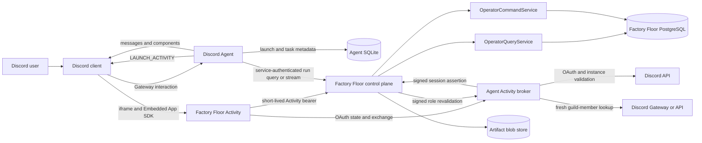
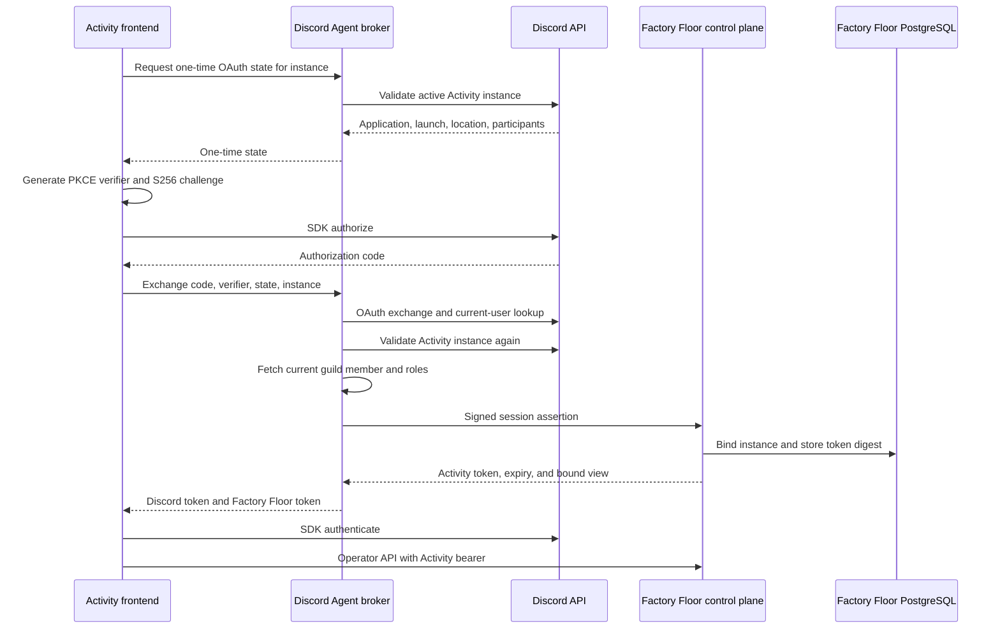

# Discord Activity operator interface

**Type:** Explanation  
**Status:** Proposed architecture; implementation not started  
**Platform verification:** Discord developer documentation reviewed July 17, 2026

This document explains how Factory Floor can appear as a Discord Activity inside Discord Agent without moving runtime authority into Discord.

The implementation sequence and cross-repository dependencies are tracked in Factory Floor issue #33. This page records the durable architectural intent and trust boundaries; it is not an active task plan.

## Product objective

A user in a Discord Agent project channel or task thread can open an embedded Activity showing the relevant Factory Floor installation, run, region, execution trace, artifacts, approvals, alerts, and participants.

Discord owns:

- conversation and Discord-native messages;
- launch, guild, channel, thread, and task context;
- Discord identity, guild membership, roles, and presence;
- buttons, select menus, modals, polls, and follow-up messages.

Factory Floor remains the sole authority for:

- commands and runs;
- deliveries, executions, and attempts;
- artifacts and lineage;
- policy decisions and approvals;
- cancellation;
- durable runtime truth.

The Activity is an operator interface. It is never a second scheduler, event store, approval ledger, execution runtime, or artifact catalog.

## Constraints

- Keep Discord concepts out of `packages/runtime-core` and authoritative runtime tables.
- Do not change Factory Floor's durable execution semantics.
- Do not copy runtime events, deliveries, executions, attempts, artifacts, lineage, policies, or approvals into Discord Agent SQLite.
- Preserve the standalone Factory Floor console.
- Preserve Discord Agent's project, task, worktree, and provider behavior.
- Do not put bot tokens, OAuth client secrets, service HMAC secrets, Discord OAuth tokens, or Activity session tokens in source control, browser storage, SQLite, or PostgreSQL.
- Do not add a second runtime service, GraphQL, Kafka, Temporal, or a custom WebSocket tier for this integration.

## Existing system fit

### Factory Floor

The current console already provides most of the required read-only operator experience:

- factory and projection health;
- topology and lineage graphs with text fallbacks;
- execution, trace, delivery, attempt, retry, input, output, and event views;
- artifact, resource, policy, projection, and operation views;
- finite cursor-based server-sent event batches with polling fallback.

`OperatorQueryService` and `OperatorCommandService` are transport-neutral and remain the authority behind the Activity. The Activity requires generic extensions such as run-scoped approvals, topology, alerts, and a run-scoped finite event stream. Those extensions must not mention Discord.

The standalone console may continue using its existing deployment-specific operator token. The embedded Activity must not compile or share that token.

### Discord Agent

Discord Agent already owns project channels, task threads, Discord authorization, interaction routing, confirmation components, approvals, polls, SQLite migrations, and provider-neutral task orchestration.

The Activity adapter attaches to project and task identity. It does not attach to provider sessions or worktrees.

## Architecture decisions

1. **The Activity frontend belongs in Factory Floor.** It reuses Factory Floor operator client and UI code and builds separately from the standalone console.
2. **Discord Agent hosts an Activity broker inside its existing process.** The broker participates in the normal runtime start and stop lifecycle; it is not a new deployment unit.
3. **Factory Floor's control plane owns Activity sessions and all operator reads and mutations.** Discord-specific transport code remains behind an adapter boundary in `apps/control-plane`.
4. **After bootstrap, the browser queries Factory Floor directly through Discord URL mappings.** Discord Agent does not become a long-lived proxy for runtime data.
5. **Discord Agent owns Discord OAuth exchange, Activity-instance validation, guild-member lookup, role mapping, and trusted launch-context resolution.** Its bot token and OAuth client secret never leave the Agent process.
6. **Factory Floor issues a short-lived opaque Activity bearer from a service-authenticated assertion.** Only a digest of that bearer is stored.
7. **Factory Floor remains the source of runtime events.** Discord synchronization stores only cursors, Discord message linkage, and rendered-payload digests.



## Binding and identity model

### Discord task to Factory Floor run

Discord Agent owns the adapter binding between a task or thread and a Factory Floor installation and run.

The Factory Floor run identifier is opaque. It must be obtained from a successful service-authenticated lookup, never derived from a Discord ID, URL, query string, or browser selection.

The first release should support at most one active run binding per Discord task. Archiving or deleting the Discord task never deletes the Factory Floor run. An unbound task may open an installation overview, but it may not claim a browser-selected run.

### Activity instance to operator view

Factory Floor owns the binding between a verified Discord Activity instance and the selected operator view.

A view may represent:

- an installation;
- a run;
- a region within a run;
- an execution within a run;
- an artifact within a run;
- an approval within a run;
- installation- or run-scoped alerts.

The first authorized participant binds the verified instance to a server-selected launch registration. Later authorized participants in the same verified instance receive the established binding.

Query strings, component identifiers, route parameters, and browser-provided IDs are navigation hints only. They cannot create or replace the authoritative instance binding. Selecting another run requires another trusted launch or an explicit server-authorized selection.

### Discord roles to operator principal

Discord Agent maps a freshly fetched guild member to a generic Factory Floor principal:

```ts
{
  id: `discord:user:${discordUserId}`,
  roles: ['operator'] | ['operator', 'admin']
}
```

`admin` implies `operator`. Existing broad bot authorization remains separate from Activity-specific operator and admin role configuration.

Role snapshots are not authority. Revalidate the current guild member at bootstrap, token refresh, and immediately before approval or cancellation.

## Trusted launch and authentication

### Trusted launch registration

Supported launches use app-handled Discord interactions:

- one global `PRIMARY_ENTRY_POINT` command with `APP_HANDLER`;
- project-channel and task-thread launch buttons;
- focused approval or alert launch buttons.

Before responding with `LAUNCH_ACTIVITY`, Discord Agent resolves the guild, channel, thread, project, task, installation, run, view, user, and current roles. It records a one-time launch registration with a short active lifetime.

The browser cannot supply trusted guild, task, run, or view fields.

### OAuth and session bootstrap

1. The Activity constructs `DiscordSDK` and reads `instanceId`.
2. It requests one-time OAuth state from Discord Agent using only that instance ID.
3. Discord Agent validates the active Activity instance and allowed location through Discord's bot-authenticated API.
4. The Activity creates an in-memory PKCE verifier and calls SDK `authorize` with an S256 challenge and the one-time state.
5. The Activity sends the code, verifier, state, and instance ID to Discord Agent.
6. Discord Agent atomically consumes the state, exchanges the code, obtains the current Discord user, validates the Activity instance again, requires the user to be connected to that instance, fetches current guild roles, and matches a valid launch registration or existing Factory Floor instance binding.
7. Discord Agent sends a signed session assertion to Factory Floor.
8. Factory Floor creates or joins the instance binding and returns an opaque Activity bearer.
9. Discord Agent returns the Discord access token and Factory Floor bearer with `Cache-Control: no-store`.
10. The Activity calls SDK `authenticate`; both tokens remain in memory only.



### Activity session lifetime

Use a cryptographically random opaque token and store only its SHA-256 digest.

The initial design uses short absolute and idle lifetimes, rotates the token during refresh, and caps the continuous instance lease without fresh OAuth. Refresh requires active-instance validation and fresh role validation. A Discord Activity-instance `404` closes the binding and revokes its sessions.

Reject expired, revoked, wrong-instance, wrong-origin, and wrong-installation tokens.

## Service authentication

Discord Agent and Factory Floor use separate directional HMAC-SHA256 keys supplied by environment or secret management.

Sign a version, key ID, timestamp, nonce, method, normalized path, and exact body digest. Validation requires:

- exact method, path, and body-byte agreement;
- bounded timestamp skew;
- a durable one-time nonce per key and direction;
- constant-time signature comparison;
- current and previous keys during rotation;
- distinct keys for Agent-to-Factory-Floor and Factory-Floor-to-Agent traffic.

This authentication is for service assertions and reverse role revalidation. It does not replace the short-lived user Activity session.

## HTTP boundaries

### Discord Agent public broker

The browser-facing broker provides only:

- one-time OAuth state issuance;
- OAuth code exchange and Activity-session bootstrap.

It accepts an Activity instance ID but no trusted run, task, guild, channel, or view selection. Responses containing credentials use `Cache-Control: no-store` and safe stable error envelopes.

### Discord Agent to Factory Floor

A service-authenticated adapter endpoint creates or joins an Activity session from:

- installation and Discord application IDs;
- verified Activity instance, launch, guild, channel, and optional thread IDs;
- authenticated Discord user and mapped `OperatorPrincipal`;
- launch registration identity;
- server-selected operator view;
- role-validation timestamp.

An existing instance must match its established application, installation, and location. A new instance requires a valid launch assertion and validates the requested view through generic operator queries.

### Activity-session operator API

The Activity uses generic operator routes for:

- session context, refresh, and revocation;
- factory and run status;
- run trace and topology;
- run-scoped artifacts and artifact content;
- run-scoped approvals and alerts;
- a run-scoped finite event stream;
- approval decisions and run cancellation.

Every route enforces the installation and run scope established by the Activity session. Artifact bounds, media rules, and canonical operator authorization remain in force.

The run stream uses opaque cursors and finite SSE responses with checkpoints. Events are only refresh signals; canonical queries determine state and whether a mutation remains available.

### Factory Floor to Discord Agent

Before sensitive mutations, Factory Floor calls a reverse service-authenticated endpoint in Discord Agent. The Agent revalidates:

- the Activity instance is still active;
- application, launch, and location still match;
- the Discord user remains connected to the instance;
- the current guild member still has the required action role.

Missing instances, users, guild membership, or roles deny the mutation.

## Data ownership

### Discord Agent SQLite

Store only adapter metadata:

- project-to-installation bindings;
- task or thread-to-run bindings;
- short-lived launch registrations and OAuth-state digests;
- Discord message IDs, synchronization cursors, and rendered digests;
- service-request replay nonces.

Do not store Factory Floor runtime state or event history, artifact bodies, approval records, OAuth tokens, Activity tokens, or integration secrets.

### Factory Floor PostgreSQL

Use additive adapter-specific tables for:

- Activity instance-to-view bindings;
- Activity session token digests and expiry or revocation metadata;
- bounded collaborative view state;
- service-request replay nonces.

Do not add Discord columns to runtime tables. Do not store Discord bot credentials, OAuth secrets or tokens, transcripts, or provider sessions.

## Reusable frontend boundaries

The intended package split is:

```text
packages/
  operator-client/     operator DTOs, cursor handling, and HTTP client
  operator-ui/         reusable React views, graphs, tables, and formatters
apps/
  console/             standalone shell and standalone authentication adapter
  discord-activity/    Embedded App SDK shell and Activity-session adapter
  control-plane/
    src/routes/operator.ts
    src/adapters/discord/
```

Move reusable graph construction, trace and artifact views, and formatters without changing standalone-console behavior. Keep routing, authentication, and environment adapters in their respective applications.

Do not import `@discord/embedded-app-sdk` into the standalone console, server packages, or runtime core. Preserve topology and lineage text fallbacks.

## Collaboration and live state

The Discord Activity instance is the collaboration scope.

Shared state may include the selected operator view, non-sensitive filters, and presenter or follow mode. Private state includes tokens, confirmation text, copied artifact content, and personal accessibility preferences.

Use bounded optimistic concurrency for shared view state. A stale update returns the current revision rather than overwriting another participant's selection.

Participant APIs and presence are visual conveniences only. They never authorize access or mutations.

Prefer finite run-scoped SSE using the existing cursor and checkpoint model. Use `fetch` rather than native `EventSource` so the Activity bearer can be attached. Keep cursors in memory, deduplicate by event ID, bound client buffers, slow reconnect while hidden, and retain polling as a first-class fallback for proxy buffering, stale cursors, or unsupported streaming.

## Approval and cancellation

Approval and cancellation use existing Factory Floor command semantics.

For each mutation:

1. Query current canonical state.
2. Show the exact target, impact, and required reason.
3. Require explicit confirmation.
4. Revalidate the active instance and current Discord roles through Discord Agent.
5. Submit one stable `clientRequestId` to `OperatorCommandService`.
6. Return the existing idempotent receipt on replay.
7. Treat changed context as a conflict that requires refresh.

No browser or Discord component writes a runtime table directly.

## Discord message synchronization

Discord Agent may synchronize a narrow projection of canonical state:

- run accepted, started, or terminal;
- approval requested or resolved;
- material blocked or failure alerts;
- cancellation requested or completed.

The Agent stores only the run-scoped cursor, Discord message linkage, and last rendered digest. Before creating or editing a message, it re-queries Factory Floor. Rapid changes are coalesced and existing status messages are edited where possible.

Synchronization failure must not stop runtime work. Restart recovery reconciles bounded current state rather than copying event history.

## Security and deployment

- Use OAuth code grant with S256 PKCE and one-time, instance-bound state.
- Keep browser credentials in memory; use no ambient authentication cookie.
- Validate the expected Discord proxy origin and host.
- Use JSON-only mutating endpoints, strict schemas, explicit body limits, and safe stable errors.
- Put no tokens or trusted run selection in URLs.
- Configure iframe-compatible response headers rather than denying framing.
- Configure Discord URL mappings from most-specific prefix to `/`, with targets that omit the protocol.
- Use relative mapped browser paths and content-hashed static assets.
- Avoid wildcard CORS and direct arbitrary external fetches.
- Never log OAuth codes or verifiers, access or session tokens, HMAC signatures, raw authorization headers, secrets, or artifact bodies.
- Record request IDs, safe principal and action metadata, latency, validation age, and hashed identifiers.

A representative mapping is:

```text
/agent-api  -> Discord Agent broker host
/ff-api     -> Factory Floor control-plane host
/           -> Activity static host
```

The broker and static assets require stable public HTTPS. Reverse revalidation should use private networking where possible. The proxy must support finite SSE without buffering and must honor no-store responses.

## Rollout and rollback

Roll out additively and behind independent flags:

1. Add generic operator routes and reusable UI while preserving the standalone console.
2. Add disabled adapter tables and service authentication in both repositories.
3. Enable read-only Activity sessions for one bound project.
4. Add reverse role revalidation.
5. Enable approval and cancellation behind a separate mutation flag.
6. Add collaborative state and Discord message synchronization last.
7. Run a one-project canary before broader enablement.

Rollback disables Discord Agent launch and broker behavior, disables Factory Floor Activity sessions, revokes Activity sessions, and stops message synchronization. Additive adapter tables remain until a later deliberate cleanup. Rollback never deletes or rewrites runtime commands, events, executions, approvals, or artifacts.

## Verification strategy

Required coverage includes:

- launch registration, ambiguity rejection, expiry, and restart;
- OAuth state, PKCE, instance validation, and role mapping;
- HMAC canonicalization, skew, rotation, and nonce replay;
- Activity session digest, scope, rotation, expiry, revocation, and origin checks;
- run isolation across trace, artifact, approval, topology, alert, and stream routes;
- idempotent approval and cancellation with reverse role validation;
- migration upgrades with no plaintext-token or copied-runtime-state columns;
- standalone-console behavior and accessibility;
- mocked Embedded App SDK lifecycle and responsive graph text fallbacks;
- production proxy SSE and polling fallback;
- credentialed desktop, web, iOS, and Android acceptance;
- Agent and Factory Floor restart recovery.

Cross-repository request and response fixtures must be versioned and verified by both consumer and provider tests. Neither repository enables the feature by default until the counterpart is merged and deployable.

## Principal risks

- Discord library support for type-4 commands and type-12 responses may require an upgrade or a narrowly tested raw REST path.
- Activity-instance location semantics for threads require credentialed verification.
- A local-first Discord Agent still needs stable public HTTPS ingress for the broker.
- OAuth and PKCE behavior must be tested across desktop, web, iOS, and Android.
- Discord proxy buffering or timeouts may require polling more often than expected.
- Fresh role lookups must remain secure without exceeding Discord API limits.
- Instance cleanup must tolerate delayed detection because there is no durable close callback.
- Native Discord and Activity approval actions may race; Factory Floor idempotency and conflict handling remain decisive.
- Cross-repository contracts may drift without shared versioned fixtures.
- Mobile graph usability depends on complete text alternatives.

## Rejected alternatives

- Embedding the standalone console with a shared static operator token.
- Proxying every runtime query and mutation through Discord Agent.
- Copying Factory Floor runtime state or events into SQLite.
- Forking the operator frontend into Discord Agent.
- Authorizing from browser query data, SDK participant data, or cached roles.
- Binding runs or instances from query parameters.
- Persisting OAuth tokens for refresh.
- Using cookie-only authentication for the first version.
- Adding a custom WebSocket service.
- Landing one cross-repository implementation mega-PR.

## Implementation tracking

Factory Floor issue #33 owns the reviewable implementation sequence, dependencies, safe parallelism, and cross-repository completion gates. The companion Discord Agent planning PR is `laurajoyhutchins/discordagent#14`.

## Discord platform references

The following official references supported the design as of July 17, 2026. Re-check them before implementation because Discord platform behavior may change.

- <https://docs.discord.com/developers/activities/how-activities-work>
- <https://docs.discord.com/developers/developer-tools/embedded-app-sdk>
- <https://docs.discord.com/developers/activities/development-guides/multiplayer-experience>
- <https://docs.discord.com/developers/activities/development-guides/local-development>
- <https://docs.discord.com/developers/activities/development-guides/user-actions>
- <https://docs.discord.com/developers/interactions/application-commands>
- <https://docs.discord.com/developers/interactions/receiving-and-responding>
- <https://docs.discord.com/developers/resources/application#get-application-activity-instance>
